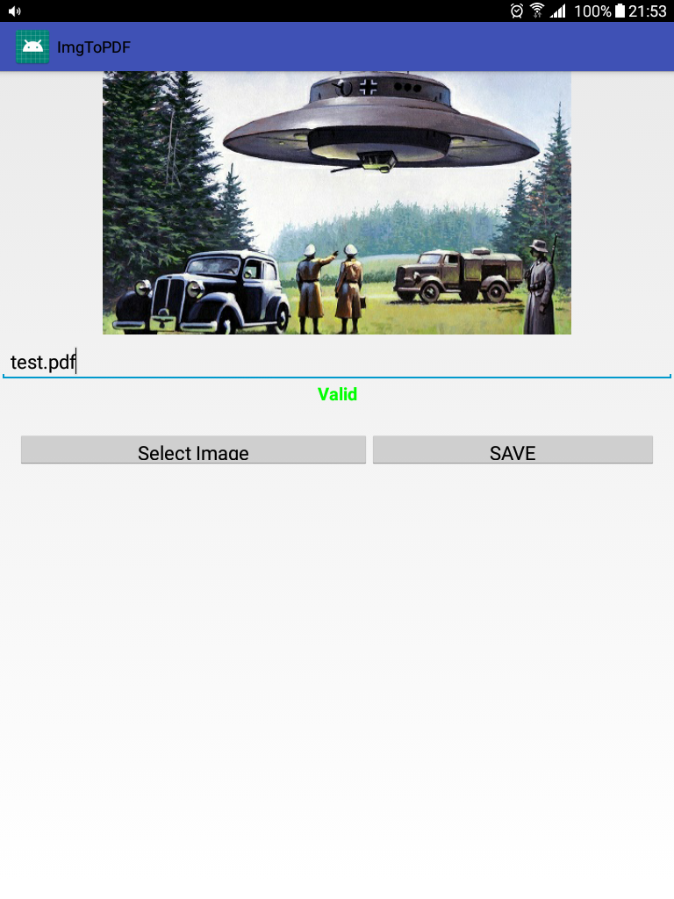
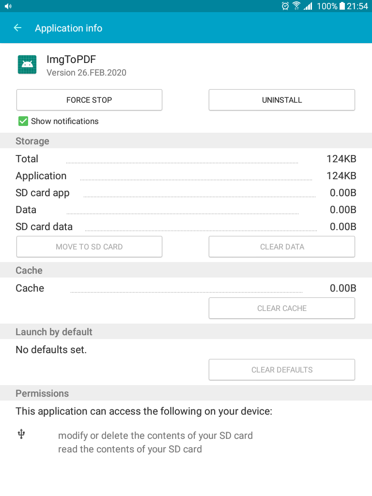

# ImgToPDF
Convert your images to pdf files in Android.

## Things to do

- Convert multiple images to pdf files.
- Storage location is Files/Internal Files/Download which is challenging for user to open pdf files. Therefore, direction in some way into file, which contains pdf files, will be a good shortcut.

